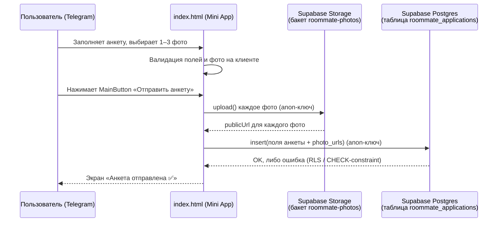
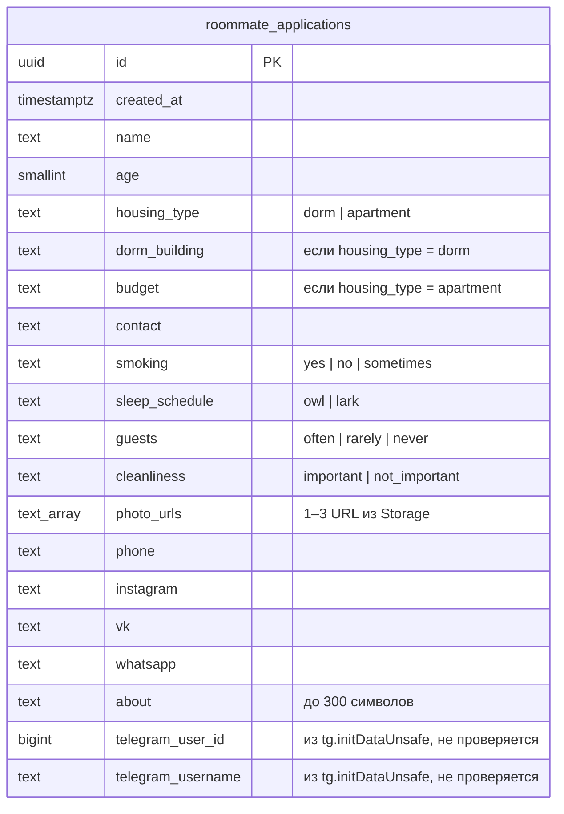

# TelApp — «Анкета сожителя»

Telegram Mini App (чистые HTML/CSS/JS, без фреймворков) — форма анкеты для
поиска сожителей. Анкета и фото сохраняются в Supabase.

- `index.html` — сама форма (UI, валидация, условная логика, отправка в Supabase)
- `supabase/schema.sql` — SQL-схема: таблица, RLS-политики, Storage-бакет для фото

## Как это работает



Ключевая деталь: **и загрузка фото, и запись в таблицу идут прямо из
браузера пользователя** с публичным anon-ключом — отдельного backend-сервера
нет. Всё разграничение прав держится на Row Level Security (RLS) в Postgres
и на политиках Storage.

## Схема данных

Таблица `public.roommate_applications` (полный SQL — в
[`supabase/schema.sql`](supabase/schema.sql)):



Фото хранятся не в таблице, а в Storage-бакете `roommate-photos`
(до 5 МБ, только изображения) — в БД лежат лишь их публичные ссылки.

## Доступ и безопасность — кто может достучаться до базы?

**Anon-ключ (`SUPABASE_ANON_KEY`) публичный по дизайну** — он лежит прямо в
`index.html`, и любой может увидеть его через «Просмотр кода страницы» или
DevTools. Это нормально для Supabase: безопасность обеспечивает не
секретность ключа, а RLS-политики. Но это значит, что **с этим ключом можно
слать запросы к API напрямую (curl/Postman), в обход самой формы**:

| Действие | Доступно с любого устройства (anon-ключ)? | Почему |
|---|---|---|
| Прочитать чужие анкеты (`SELECT`) | ❌ Нет | policy на `SELECT` не создана → RLS блокирует по умолчанию |
| Изменить / удалить анкету (`UPDATE`/`DELETE`) | ❌ Нет | policy не создана → блокируется |
| Создать анкету (`INSERT`) | ✅ Да, любую | policy разрешает всем: `with check (true)` |
| Загрузить файл в бакет `roommate-photos` | ✅ Да | policy разрешает `INSERT` в `storage.objects` анониму |
| Скачать / открыть фото | ✅ Да (осознанно) | бакет публичный — иначе фото не отобразятся у других |

**Вывод:**

- 🔒 **Персональные данные защищены на чтение** — имя, контакт, телефон,
  «о себе», фото других людей нельзя выгрузить через anon-ключ, пока вы сами
  не добавите `SELECT`-политику.
- ⚠️ **Но таблицу можно заспамить.** INSERT-политика проверяет только
  структуру данных (`CHECK`-constraints: диапазоны значений, длину строк,
  1–3 фото), а не то, что запрос реально пришёл из вашей формы. Значит,
  кто угодно может напрямую создавать фейковые анкеты или заливать
  произвольные картинки в Storage, минуя `index.html`.
- ⚠️ **`telegram_user_id` / `telegram_username` не верифицируются.** Они
  берутся из `tg.initDataUnsafe` на клиенте без проверки HMAC-подписи на
  сервере — их можно подделать прямым запросом к API. Это не даёт доступа
  к чужим данным, но эти поля нельзя считать 100%-но достоверными.
- ✅ `service_role` ключ (полный доступ в обход RLS) в проекте **нигде не
  используется в браузере** — это правильно. Его нельзя добавлять в
  `index.html` ни при каких обстоятельствах.

### Если понадобится усилить защиту

- Добавить проверку HMAC-подписи `initData` на сервере (Supabase Edge
  Function) перед `insert`, чтобы доверять `telegram_user_id`.
- Ограничить частоту отправок (rate limiting) или добавить капчу — сейчас
  ничего не мешает боту слать сотни INSERT-запросов подряд.
- Если появится экран «смотреть анкеты других» — добавить точечную
  `SELECT`-политику (пример уже есть закомментированным в
  `supabase/schema.sql`), а не открывать таблицу целиком.

## Настройка

1. Выполнить [`supabase/schema.sql`](supabase/schema.sql) в SQL Editor
   вашего проекта Supabase.
2. В `index.html` подставить свои значения:
   ```js
   const SUPABASE_URL = 'https://YOUR_PROJECT.supabase.co';
   const SUPABASE_ANON_KEY = 'YOUR_ANON_PUBLIC_KEY';
   ```
   (Project Settings → API → Project URL / anon public key)

## Исходное ТЗ

Напиши мне полноценное Telegram Mini App на HTML/CSS/JavaScript (без фреймворков,
) — форму анкеты для поиска сожителей.

Требования к форме:

1. Общие поля:
    - Имя + никнейм ( обязательно)
    - Возраст (число, обязательно)
    - Тип жилья: радио-кнопки "Общежитие" / "Съёмная квартира" (обязательно)
    - Контакт для связи (текст, плейсхолдер "@username", обязательно)

2. Условная логика (без перезагрузки страницы):
    - Если выбрано "Общежитие" — показать поле "Корпус/номер общежития" (текст)
    - Если выбрано "Съёмная квартира" — показать поле "Бюджет" (селект с диапазонами)

3. Образ жизни (селекты или радио-кнопки, не текстовые поля):
    - Курение: Да / Нет / Иногда
    - Режим сна: Сова / Жаворонок
    - Гости: Часто / Редко / Никогда
    - Чистота: Важно / Не принципиально

4. Фотографии:
    - Загрузка от 1 до 3 фото (input type="file", accept="image/*", multiple)
    - Превью загруженных фото сразу на странице (миниатюры)
    - Возможность удалить выбранное фото до отправки
    - Валидация: минимум 1 фото, максимум 3 — не давать загрузить больше и не давать
      отправить форму без хотя бы одного фото
    - Ограничение размера файла (например, до 5 МБ на фото) с понятным сообщением об ошибке
    - Конвертируй фото в base64 для последующей отправки (пока нет backend — просто
      подготовь данные в этом формате)

5. Опционально:
    - Соцсети (текст, необязательное поле)
    - О себе (textarea, лимит 300 символов, со счётчиком символов)

6. Технические требования:
    - Используй Telegram WebApp JS API (telegram-web-app.js)
    - Провалидируй все обязательные поля и фото перед отправкой (не давай отправить
      форму, если что-то не заполнено)
    - При успешной валидации собери все данные (включая фото в base64) в один JSON-объект
      и выведи его в console.log (временно, пока нет backend — позже заменим на отправку
      на сервер)
    - Адаптивный дизайн под мобильный экран (форма открывается внутри Telegram)
    - Используй Telegram.WebApp.themeParams для цветов (форма подстраивается под тему
      пользователя — светлую/тёмную)
    - Кнопка отправки — через Telegram.WebApp.MainButton, а не обычную HTML-кнопку
    - Код должен быть чистым и с комментариями, чтобы новичок мог в нём ориентироваться

Выведи весь код одним файлом index.html.
